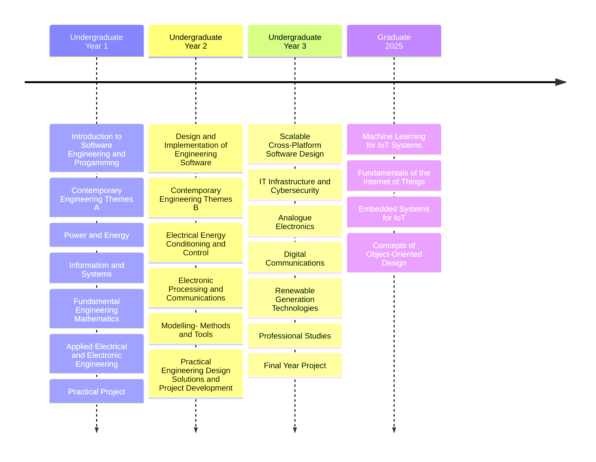

## Hi there 👋

Thank you for stopping by my GitHub profile. I am currently studying for a Master of Science degree in Cyber-Physical Systems at Northeastern University, having recently graduated with a Bachelor of Engineering degree in Electronic and Computer Engineering from the Univeristy of Nottingham.

My current areas of study include:

* Machine Learning Algorithms
* Network Analysis
* Object-Oriented Programming in Java
* Embedded System Software Development using C++ and FreeRTOS

Past Study:

Let's connect!

[LinkedIn](https://linkedin.com/in/sohampatwardhan149) | [NUworks](https://northeastern-csm.symplicity.com/profiles/soham.patwardhan) | [ORCID](https://orcid.org/0000-0001-7257-0422) | [Reddit](https://reddit.com/u/sohampatwardhan)

<!--
**sohampatwardhan/sohampatwardhan** is a ✨ _special_ ✨ repository because its `README.md` (this file) appears on your GitHub profile.

Here are some ideas to get you started:

- 🔭 I’m currently working on ...
- 🌱 I’m currently learning ...
- 👯 I’m looking to collaborate on ...
- 🤔 I’m looking for help with ...
- 💬 Ask me about ...
- 📫 How to reach me: ...
- 😄 Pronouns: ...
- ⚡ Fun fact: ...
-->
