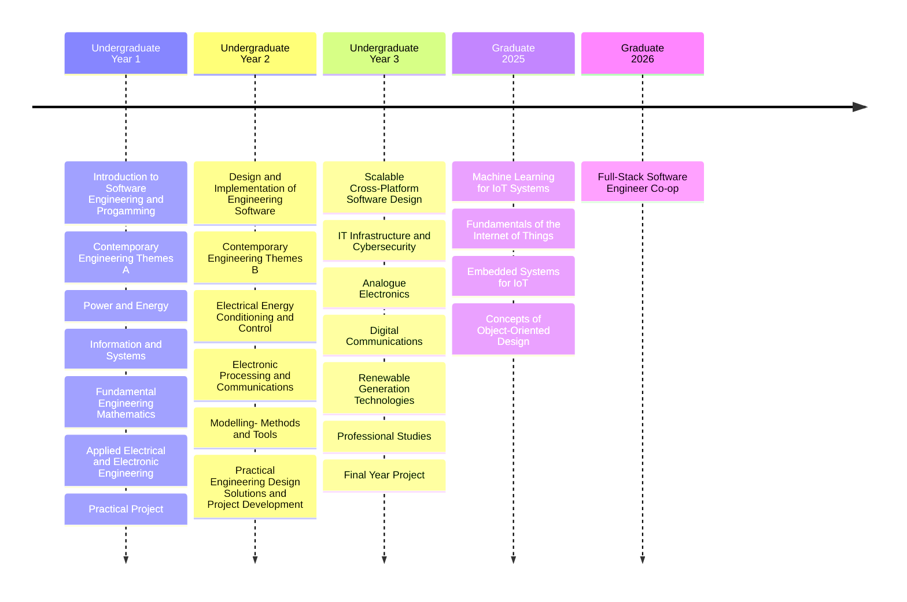

## Hi there 👋

Thank you for stopping by my GitHub profile. I am currently on a co-op at @ThriveIEP, an ed-tech startup in Cambridge, MA, working as a full-stack developer. I am currently pursuing a Master of Science degree in Cyber-Physical Systems at Northeastern University (Boston, MA), expecting to graduate in April 2027.

I hold a Bachelor of Engineering degree in Electronic and Computer Engineering from the Univeristy of Nottingham in the UK, having graduated in December 2024.

### Courses Taken:

```mermaid

timeline
    Undergraduate<br>Year 1 : Introduction to Software Engineering and Progamming
                            : Contemporary Engineering Themes A
                            : Power and Energy
                            : Information and Systems
                            : Fundamental Engineering Mathematics
                            : Applied Electrical and Electronic Engineering: Practical Project

    Undergraduate<br>Year 2 : Design and Implementation of Engineering Software
                            : Contemporary Engineering Themes B
                            : Electrical Energy Conditioning and Control
                            : Electronic Processing and Communications
                            : Modelling- Methods and Tools
                            : Practical Engineering Design Solutions and Project Development

    Undergraduate<br>Year 3 : Scalable Cross-Platform Software Design
                            : IT Infrastructure and Cybersecurity
                            : Analogue Electronics
                            : Digital Communications
                            : Renewable Generation Technologies
                            : Professional Studies
                            : Final Year Project

    Graduate<br>2025        : Machine Learning for IoT Systems
                            : Fundamentals of the Internet of Things
                            : Embedded Systems for IoT
                            : Concepts of Object-Oriented Design

    Graduate<br>2026        : Full-Stack Software Engineer Co-op

```

### Certifications earned

* [ISC2 Certified in Cybersecurity (CC)](https://www.credly.com/badges/58cd4242-2597-4c6e-a31a-fe79deb416dd/public_url)
  * Certification Cycle: Oct 1, 2025 - Sep 30, 2028
  * Certified since: 2025

### Let's connect!

[LinkedIn](https://linkedin.com/in/sohampatwardhan149) | [NUworks](https://northeastern-csm.symplicity.com/profiles/soham.patwardhan) | [Credly](https://www.credly.com/users/sohampatwardhan/) | [ORCID](https://orcid.org/0000-0001-7257-0422) | [Reddit](https://reddit.com/u/sohampatwardhan)

<!--
**sohampatwardhan/sohampatwardhan** is a ✨ _special_ ✨ repository because its `README.md` (this file) appears on your GitHub profile.

Here are some ideas to get you started:

- 🔭 I’m currently working on ...
- 🌱 I’m currently learning ...
- 👯 I’m looking to collaborate on ...
- 🤔 I’m looking for help with ...
- 💬 Ask me about ...
- 📫 How to reach me: ...
- 😄 Pronouns: ...
- ⚡ Fun fact: ...
-->
